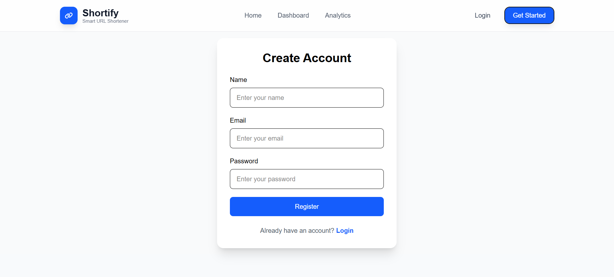
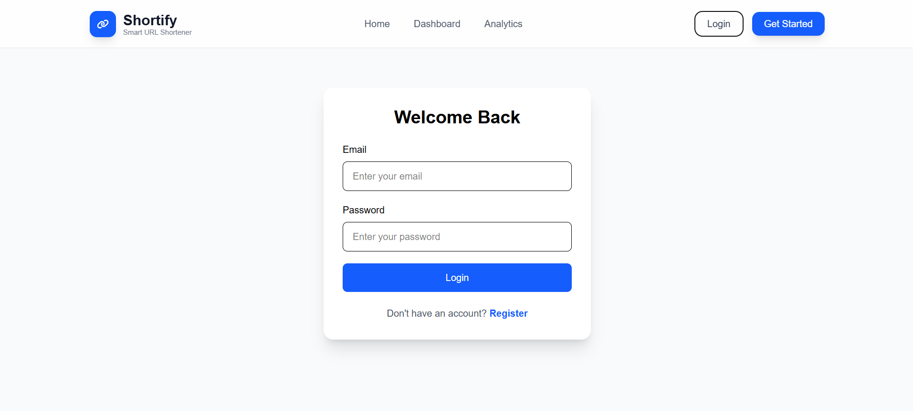
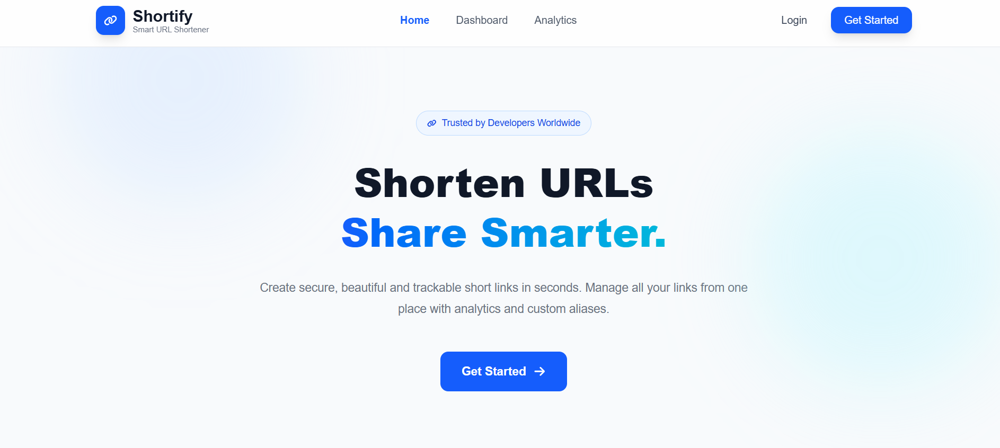
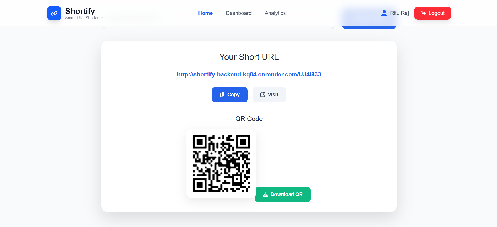
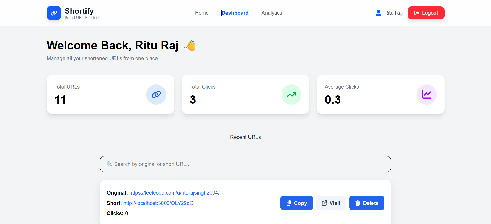
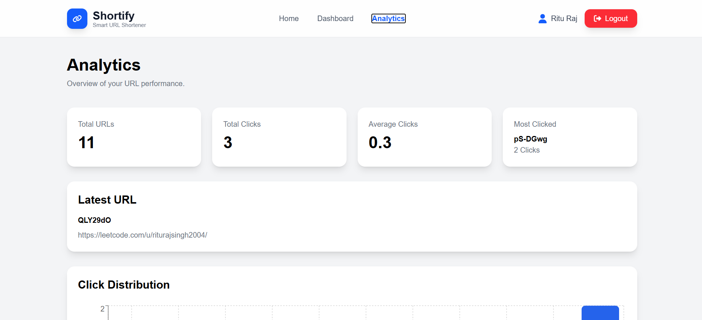

<h1 align="center">🚀 Shortify</h1>

<p align="center">
A modern Full-Stack MERN URL Shortener that allows users to create, manage, and share short URLs securely.
</p>

<p align="center">

🌐 <a href="https://shortify-iota-two.vercel.app">Live Demo</a> •
💻 <a href="https://github.com/rituraj821310/Shortify">GitHub Repository</a>

</p>

---

# 🌟 About The Project

Shortify is a full-stack URL shortening platform built using the MERN stack. It enables users to create secure short links, manage them through a personalized dashboard, and access them anywhere. The application features JWT authentication, MongoDB Atlas for data storage, and cloud deployment using Render and Vercel.

---

# 🚀 Live Demo

### 🌐 Frontend

https://shortify-iota-two.vercel.app

### ⚙️ Backend API

https://shortify-backend-kq04.onrender.com

### 💻 GitHub Repository

https://github.com/rituraj821310/Shortify

---

# 📸 Project Preview

## 📝 Register Page



---

## 🔐 Login Page



---

## 🏠 Home Page



---

## 🔗 Generated Short URL & QR Code



---

## 📊 Dashboard



---

## 📈 Analytics



---

# ✨ Features

- 🔐 Secure JWT Authentication
- 🔗 Generate unique short URLs
- ✍️ Create custom short URLs (Custom Slug)
- 📜 Personal URL History Dashboard
- 🗑️ Delete previously created URLs
- ⚡ Fast URL Redirection
- 📱 Fully Responsive User Interface
- ☁️ Cloud Deployment using Render & Vercel
- 🍪 HTTP-only Cookie Authentication
- 💾 MongoDB Atlas Integration

---

# 🛠️ Tech Stack

## Frontend

- React.js
- Vite
- Tailwind CSS
- Axios
- React Router DOM
- React Hot Toast
- React Icons
- Framer Motion

---

## Backend

- Node.js
- Express.js
- MongoDB Atlas
- Mongoose
- JWT Authentication
- Cookie Parser
- CORS
- NanoID
- bcrypt

---

## Deployment

- Vercel (Frontend)
- Render (Backend)
- MongoDB Atlas (Database)

---

# 📁 Project Structure

```text
Shortify
│
├── BACKEND
│   ├── src
│   ├── app.js
│   ├── package.json
│   └── .env
│
├── FRONTEND
│   ├── src
│   ├── public
│   ├── package.json
│   └── vite.config.js
│
├── assets
│   ├── home.png
│   ├── register.png
│   ├── login.png
│   ├── dashboard.png
│   └── analytics.png
│
└── README.md
```

---

# ⚙️ Installation

## Clone the Repository

```bash
git clone https://github.com/rituraj821310/Shortify.git
```

Move into the project directory

```bash
cd Shortify
```

---

## Backend Setup

```bash
cd BACKEND
npm install
npm run dev
```

---

## Frontend Setup

```bash
cd FRONTEND
npm install
npm run dev
```

---

# 🔑 Environment Variables

Create a `.env` file inside the **BACKEND** folder.

```env
MONGO_URI=your_mongodb_connection_string

JWT_SECRET=your_secret_key

APP_URL=http://localhost:3000/

NODE_ENV=development
```

---

# 🚀 Deployment

### Frontend

- Vercel

### Backend

- Render

### Database

- MongoDB Atlas

---

# 🎯 Future Improvements

- 📊 Advanced Click Analytics
- 📈 Interactive Charts
- 🌙 Dark Mode
- ⭐ Favorite URLs
- 🔍 Search & Filter URLs
- 📥 Export URL History
- 📱 QR Code Generation
- ⏳ URL Expiration
- 🔒 Password Protected URLs

---

# 🤝 Contributing

Contributions are welcome!

1. Fork the repository
2. Create your feature branch

```bash
git checkout -b feature/AmazingFeature
```

3. Commit your changes

```bash
git commit -m "Add Amazing Feature"
```

4. Push to the branch

```bash
git push origin feature/AmazingFeature
```

5. Open a Pull Request

---

# 👨‍💻 Author

## Ritu Raj

**GitHub**

https://github.com/rituraj821310

---

# 📄 License

This project is licensed under the **MIT License**.

---

<h3 align="center">
⭐ If you like this project, don't forget to give it a star on GitHub! ⭐
</h3>